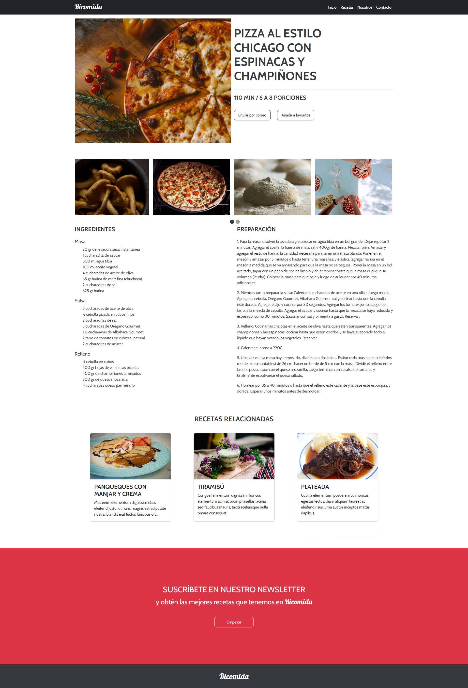

# Desafio Evaluado - Ricomida

Ricomida es una página web de recetas diseñada para compartir deliciosas recetas con el público.

## Descripción

Esta página web muestra una receta destacada en su página principal y ofrece una sección de recetas relacionadas. Los usuarios pueden suscribirse al boletín de noticias para recibir las mejores recetas directamente en su correo electrónico.

## Vista Codificada

A continuación, se muestra la imagen del resultado codificado:

## Estructura del Proyecto

El proyecto está estructurado de la siguiente manera:

- **Menú de Navegación (`<nav>`)**: Contiene enlaces a las diferentes secciones de la página, incluyendo Inicio, Recetas, Nosotros y Contacto.
- **Encabezado (`<header>`)**: Presenta una receta destacada con su imagen, ingredientes y preparación.
- **Sección Carrusel (`<section>`)**: Muestra un carrusel de imágenes relacionadas con la temática de la página.
- **Sección Ingredientes y Preparación (`<section>`)**: Detalla los ingredientes necesarios y los pasos para preparar la receta destacada.
- **Sección Recetas Relacionadas (`<section>`)**: Muestra una galería de recetas relacionadas con imágenes y descripciones.
- **Sección Newsletter (`<section>`)**: Invita a los usuarios a suscribirse al boletín de noticias.
- **Pie de Página (`<footer>`)**: Contiene el logo del sitio.

## Tecnologías Utilizadas

- HTML5
- CSS3
- Bootstrap 5
- JavaScript
- jQuery

## Autor

Este proyecto fue desarrollado por **Valeria Torrealba**.